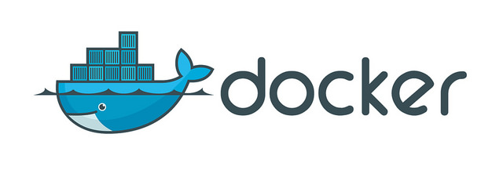
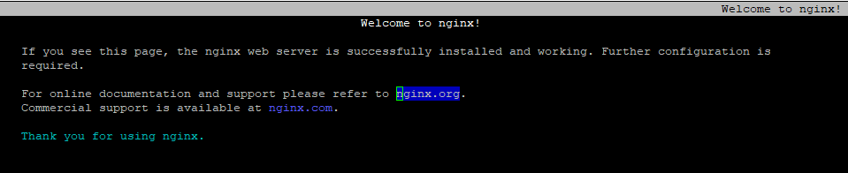

# docker quickstart

## Installing the Docker Daemon

### CentOS 7

#### docker.repo

copy the docker.repo file from /CentOS/7/etc/yum.repos.d to /etc/yum.repos.d

Next do a `yum update` to make sure you have the latest kernel. 
Minimum of a 64 bit 3.1.0 kernel required.

you can check the kernel version by running `uname -r` 
example response: "3.10.0-862.3.2.el7.x86_64"

Next install docker engine with: 
`yum install -y docker-engine`

Next enable the docker engine with: 
`systemctl enable docker`

Next we start the docker daemon with: 
`systemctl start docker`

To check that docker is running you can execute: 
`docker --version` 
example output: Docker version 17.05.0-ce, build 89658be

To check what images are installed, which are none, execute: 
`docker images`

#### docker.sock

first go to `var/run` and do a `ls -al dock*`

example output: 
-rw-r--r--. 1 root root 5 Oct 9 11:07 docker.pid 
srw-rw----. 1 root docker 0 Oct 9 11:07 docker.sock

Users that need access to docker, will need to be part of the group that is associated with the docker.sock file.

To check the current docker group membership type: 
`cat /etc/group | grep docker` 
example output: `docker:x:994:`

Add the desired user, in this case the "centos" user to the docker group: 
`usermod -a -G docker centos`

Now when you rerun the cat command you will see somthing like this: 
`docker:x:994:centos`

When you run the `docker images` command under the user it now should show something like this:

[centos@ip-111-111-111-111 ~]$ docker images 
REPOSITORY TAG IMAGE ID CREATED SIZE 
[centos@ip-111-111-111-111 ~]$

## Docker Hub

Create a free account at htt://hub.docker.com

## Docker Search

You can search (base) images containing centos in the name on docker hub by issuing the command: 
`docker search centos`

## Docker Pull

You can copy an image by using the `docker pull` command. In this example we pull the hello-world image. 
`docker pull hello-world`

Example output: 
[centos@ip-111-111-111-111 ~]$ docker pull hello-world 
Using default tag: latest 
latest: Pulling from library/hello-world 
d1725b59e92d: Pull complete 
Digest: sha256:0add3ace90ecb4adbf7777e9aacf18357296e799f81cabc9fde470971e499788 
Status: Downloaded newer image for hello-world:latest 
[centos@ip-111-111-111-111 ~]$ 

Now when we run the `docker images` command again you will see the downloaded image: 
[centos@ip-111-111-111-111 ~]$ docker images 
REPOSITORY          TAG                 IMAGE ID            CREATED             SIZE 
hello-world         latest              4ab4c602aa5e        4 weeks ago         1.84kB 

## Docker Run

To run a docker image, use the `docker run` command, followed by the name of the docker container and preferably also with the tag (in this case "latest") 
`docker run hello-world:latest` 
It will display a message and then ends the docker session.

### Docker Base image
Next we will pull both the latest version of centos and version 6 
`docker pull centos:6` 
`docker pull centos`

Executing `docker images` command now shows you the following:
REPOSITORY          TAG                 IMAGE ID            CREATED             SIZE 
hello-world         latest              4ab4c602aa5e        4 weeks ago         1.84kB 
centos              centos6             b5e5ffb5cdea        2 months ago        194MB 
centos              latest              5182e96772bf        2 months ago        200MB 

We have two images for CentOS, where the centos6 tag identifies the image containing CentOS 6.

The CentOS images are base images that are ususlly used to be modified and uploaded as new containers by users/developers.

### Docker Multilayer Container
An example of a docker image that consists of multiple layers of developer created containers is nginx. Let's pull it first 
`docker pull nginx`

The output shows this: 
[centos@ip-192-168-1-129 ~]$ docker pull nginx 
Using default tag: latest 
latest: Pulling from library/nginx 
802b00ed6f79: Pull complete 
5291925314b3: Pull complete 
bd9f53b2c2de: Pull complete 
Digest: sha256:9ad0746d8f2ea6df3a17ba89eca40b48c47066dfab55a75e08e2b70fc80d929e 
Status: Downloaded newer image for nginx:latest

In above result you can see it pulls three different layers of images: "802b00ed6f79" "5291925314b3" and "bd9f53b2c2de"

running `docker images` shows the nginx container, with a IMAGE ID

| REPOSITORY | TAG | IMAGE ID | CREATED | SIZE |
| --- | --- | --- | --- | --- |
| nginx | latest | be1f31be9a87 | 6 days ago | 109MB |
| hello-world | latest | 4ab4c602aa5e | 4 weeks ago | 1.84kB |
| centos | centos6 | b5e5ffb5cdea | 2 months ago | 194MB |
| centos | latest | 5182e96772bf | 2 months ago | 200MB |

This IMAGE (ID) "be1f31be9a87" contains all 3 layers it previously downloaded as part of the pull request.

## Docker Inspect

You can look at the configuration of the nginx docker image that you pulled by typing `docker inspect nginx`

In the bottom you will find a section containing the layers you saw being downloaded earlier: 

        "RootFS":
            "Type": "layers",
            "Layers": [
                "sha256:8b15606a9e3e430cb7ba739fde2fbb3734a19f8a59a825ffa877f9be49059817",
                "sha256:94ad191a291b0fca5a88bef06aca9c95987ddbdea9ec07ce1fd66127327a9742",
                "sha256:92b86b4e7957a1b615844b36c330212941655da2421ddd6877611781be06f2b3"

## Docker Whalesay

`docker pull docker/whalesay`

`docker run docker/whalesay cowsay hello`

## Docker ps

With `docker ps` you can see the status of running docker processes

With `docker ps -a` you can see the archived, not active docker processes

### Docker (inter)active session

first execute the `docker run -it centos:latest /bin/bash` from your ssh session 
You will be logged into the shell of the container. 
Next, open a second ssh session to your initial host and run the `docker ps` command. You will see the active docker session you have in the first ssh session.

| CONTAINER ID | IMAGE | COMMAND | CREATED | STATUS | PORTS | NAMES |
| --- | --- | --- | --- | --- | --- | --- |
| e36eb029bbef | centos:latest | "/bin/bash" | 9 seconds ago | Up 8 seconds | | vibrant_dijkstra |

### Docker detached session

you can run a docker session in a detached mode by using the `docker run -d <dockerimage>` command.

for example: ` docker run -d nginx:latest`

With the container running as an active session, you can run `docker inspect <friendly-name>` to find the IPAddress of this container session.

            "Networks": {
                "bridge": {
                    "IPAMConfig": null,
                    "Links": null,
                    "Aliases": null,
                    "NetworkID": "02159113fb59f702bea4e681cdfe8ea7427b15b5c13ba027ea16ce06ab0b42ad",
                    "EndpointID": "d17a70e4f22bf665f0c4ce6da5073df5afe255ab40b2af89fb4593a2a9a1a8d0",
                    "Gateway": "172.17.0.1",
                    "IPAddress": "172.17.0.2",
                    "IPPrefixLen": 16,
                    "IPv6Gateway": "",
                    "GlobalIPv6Address": "",
                    "GlobalIPv6PrefixLen": 0,
                    "MacAddress": "02:42:ac:11:00:02"
                }
            }

The IPAddress is 172.17.0.2

With this information, you can, for example, ping the IPAddress of the container.

[centos@ip-111-111-111-111 ~]$ ping 172.17.0.2 
PING 172.17.0.2 (172.17.0.2) 56(84) bytes of data. 
64 bytes from 172.17.0.2: icmp_seq=1 ttl=64 time=0.059 ms 
64 bytes from 172.17.0.2: icmp_seq=2 ttl=64 time=0.047 ms 
64 bytes from 172.17.0.2: icmp_seq=3 ttl=64 time=0.048 ms

Also, running the `docker ps` command you can see which ports are exposed from this docker session; in this case port 80 and 443

#### Docker session http connect

You can connect to the docker session http by using the elinks command: `elinks http://172.17.0.2`

Once started you will see a similar screen like this that confirms you are accessing the default webpage:

### Stopping (detached) docker instance

you can stop an active docker instance by typing `docker stop <friendly-name>`

### Docker with a specific name

You can start a docker container using your own friendly name to make it more easy to manage. To do this use the following syntax: 
`docker run -d --name=<NameOf-YourChoosing> <dockerimage:tag>` 
for example: `docker run -d --name=MyWeb1 nginx:latest`